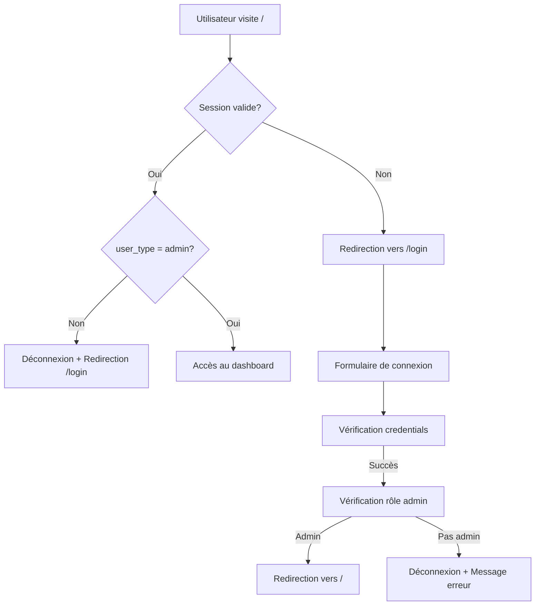

# Guide d'Authentification - TikTok Visibility Platform Admin

## 🔐 Vue d'ensemble

Le système d'authentification est maintenant **entièrement opérationnel** avec :

✅ Page de connexion sécurisée `/login`
✅ Protection automatique de toutes les routes
✅ Redirection automatique si non connecté
✅ Vérification du rôle administrateur
✅ Bouton de déconnexion dans le header
✅ Gestion de session avec Supabase Auth

---

## 🚀 Premiers pas

### 1. Créer votre premier utilisateur admin

**Via Supabase Dashboard (Recommandé):**

1. Allez dans votre projet Supabase → **Authentication** → **Users**
2. Cliquez sur **"Add user"** → **"Create new user"**
3. Entrez:
   - Email: `admin@example.com`
   - Password: `votre-mot-de-passe-sécurisé`
4. Cochez **"Auto Confirm User"**
5. Cliquez **"Create user"**

**Ensuite, ajoutez le profil admin:**

1. Allez dans **Table Editor** → **user_profiles**
2. Cliquez **"Insert"** → **"Insert row"**
3. Remplissez:
   ```
   id: [UUID de l'utilisateur créé à l'étape précédente]
   email: admin@example.com
   first_name: Admin
   last_name: Principal
   user_type: admin
   status: active
   email_verified: true
   ```
4. Cliquez **"Save"**

**Alternative - SQL Direct:**

```sql
-- 1. Créer l'utilisateur dans auth.users (via Dashboard Authentication)

-- 2. Ajouter le profil admin
INSERT INTO public.user_profiles (
  id,
  email,
  first_name,
  last_name,
  user_type,
  status,
  email_verified
) VALUES (
  '[UUID-de-votre-utilisateur]',
  'admin@example.com',
  'Admin',
  'Principal',
  'admin',
  'active',
  true
);
```

---

## 📖 Utilisation

### Connexion

1. Ouvrez `http://localhost:3000`
2. Vous êtes **automatiquement redirigé** vers `/login`
3. Entrez vos identifiants admin
4. Après connexion, vous êtes redirigé vers le dashboard `/`

### Déconnexion

- Cliquez sur le bouton **"Déconnexion"** dans le header (en haut à droite)
- Vous êtes automatiquement redirigé vers `/login`

---

## 🛡️ Sécurité

### Protection des routes

**Toutes les routes sont protégées automatiquement** via le middleware:

- ✅ `/` - Dashboard (protégé)
- ✅ `/campaigns/*` - Campagnes (protégé)
- ✅ `/disputes/*` - Litiges (protégé)
- ✅ `/finances/*` - Finances (protégé)
- ✅ `/users/*` - Utilisateurs (protégé)
- ✅ `/validation/*` - Validation (protégé)
- ✅ `/system/*` - Système (protégé)
- 🔓 `/login` - Connexion (public)
- 🔓 `/api/*` - API endpoints (gestion spécifique)

### Vérifications de sécurité

Le middleware vérifie automatiquement:

1. **Session valide** - Token Supabase Auth
2. **Utilisateur existe** - Présence dans `user_profiles`
3. **Rôle admin** - `user_type = 'admin'`
4. **Statut actif** - `status = 'active'`

Si l'une de ces conditions échoue → **Redirection vers `/login`**

---

## 🔧 Architecture technique

### Fichiers créés

```
src/
├── app/
│   ├── actions/
│   │   └── auth.actions.ts          # Actions serveur (signIn, signOut, getUser)
│   └── login/
│       └── page.tsx                  # Page de connexion
├── components/
│   └── auth/
│       ├── LoginForm.tsx             # Formulaire de connexion
│       └── LogoutButton.tsx          # Bouton déconnexion
├── layout/
│   └── AppHeader.tsx                 # Header avec bouton déconnexion
└── middleware.ts                      # Protection des routes
```

### Actions serveur disponibles

```typescript
import { signIn, signOut, getUser, getSession } from '@/app/actions/auth.actions';

// Connexion
const result = await signIn(formData);

// Déconnexion
await signOut();

// Récupérer l'utilisateur actuel
const user = await getUser();

// Récupérer la session
const session = await getSession();
```

---

## 🐛 Dépannage

### "Invalid Refresh Token" error

**Solution:**
1. Effacer les cookies du navigateur (F12 → Application → Cookies → Supprimer tout)
2. Ou utiliser mode navigation privée
3. Ou exécuter dans la console:
   ```javascript
   fetch('/api/auth/clear-session', { method: 'POST' }).then(() => location.reload())
   ```

### "Accès refusé. Réservé aux administrateurs"

**Cause:** L'utilisateur n'a pas le rôle `admin` dans `user_profiles.user_type`

**Solution:**
```sql
UPDATE public.user_profiles
SET user_type = 'admin'
WHERE email = 'votre-email@example.com';
```

### Redirection infinie vers /login

**Causes possibles:**
1. Variables d'environnement `.env.local` manquantes ou incorrectes
2. Connexion Supabase échouée
3. Profil utilisateur manquant

**Vérifier:**
```bash
# .env.local doit contenir:
NEXT_PUBLIC_SUPABASE_URL=https://votre-projet.supabase.co
NEXT_PUBLIC_SUPABASE_ANON_KEY=votre-clé-anon
```

---

## 📝 Notes importantes

1. **Un seul rôle par utilisateur** - `user_type` peut être: `admin`, `client`, ou `executant`
2. **Seuls les admins** peuvent accéder à cette interface
3. **Sessions persistantes** - "Keep me logged in" utilise les tokens de rafraîchissement Supabase
4. **Déconnexion automatique** si le token expire ou si le rôle change

---

## 🔄 Flow d'authentification



---

## 🚧 Prochaines étapes recommandées

1. **Créer d'autres utilisateurs admin** via le dashboard Supabase
2. **Configurer les politiques RLS** pour les autres tables
3. **Implémenter la gestion des rôles** (permissions granulaires)
4. **Ajouter l'authentification 2FA** (optionnel)
5. **Configurer les notifications email** (réinitialisation mot de passe)

---

## 📞 Support

En cas de problème, vérifiez:
1. Les logs du serveur Next.js
2. Les logs Supabase (Dashboard → Logs)
3. La console du navigateur (F12)
4. Les politiques RLS dans Supabase
